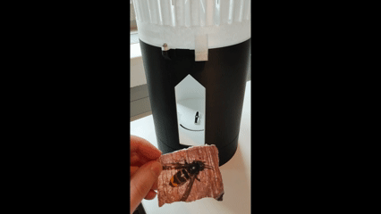

# Waspinator: Invasive Wasp Detection and Capture

A Python tool for **detecting and catching the invasive _Vespa velutina_**, while recognizing and **not triggering on native _Vespa crabro_**. Powered by the latest YOLO26 object detection model from Ultralytics.

Developed by **[Lab42](#lab42-contributors) at ERNI** ([betterask.erni](https://betterask.erni))




---

## Features

- Accurate distinction between *Vespa velutina* and *Vespa crabro*
- Automated or dry-run trap triggering
- Real-time detection from camera, image, video, or CSV files

---

## Getting Started

### Installation

Clone the repository and install dependencies:
```bash
git clone https://github.com/gitDew/waspinator.git
cd waspinator

python -m venv .venv
pip install -r requirements.txt
```


### Raspberry Pi 5

If you want to run Waspinator directly on a Raspberry Pi 5 (in [your own 3D printed trap](#hardware--3d-printing-by-dariohefti)), follow these steps to set up your environment:

1. **Install required system packages:**
    ```bash
    sudo apt update
    sudo apt install -y libgl1 libglib2.0-0
    sudo apt install python3-picamera2
    ```

2. **Set up a Python virtual environment (recommended):**
    ```bash
    # Create virtual environment
    python -m venv .venv --system-site-packages

    # Activate the virtual environment
    source .venv/bin/activate
    ```

3. **Install Python dependencies:**
    ```bash
    pip install --upgrade pip
    pip install -r requirements.txt
    ```

The Pi Camera module is supported via `python3-picamera2` so you can use the camera as a video source for wasp detection and trapping.  
Make sure your camera is enabled and properly connected.

Once everything is installed, you can start Waspinator as described in the [Usage](#usage) section.

### Requirements

- Python 3.8+
- [Ultralytics YOLO](https://docs.ultralytics.com/)
- Other dependencies as per `requirements.txt`

---

## Usage

Run the main detection-and-capture script via command line:

### Start Waspinator Trap

Detect and catch invasive *Vespa velutina* from picamera2 (**default**):

```bash
python -m waspinator start
```

From a video file:
```bash
python -m waspinator start --source path/to/video.mp4
```

Image file:
```bash
python -m waspinator start --source path/to/image.jpg
```

CSV file (for batch inference):
```bash
python -m waspinator start --source path/to/inputs.csv
```

#### Useful Options

- `--dry-run`: Do not trigger trap hardware (simulation mode)
    ```bash
    python -m waspinator start --dry-run
    ```
- `--show`: Display real-time frames/results
    ```bash
    python -m waspinator start --show
    ```
- `--step`: Manual stepping through frames (press SPACE to advance)

For all options:
```bash
python -m waspinator start --help
```

## Hardware & 3D Printing (by [@DarioHefti](https://github.com/DarioHefti))

Prototype 3D models for the waspinator trap are available in the [`hardware/`](hardware/) directory as `.stl` files. You can freely download and print these files to build your own trap housing.

## Lab42 Contributors
- Stefan Bräm
- Stefan Hoehne
- Francesco Farinoli
- Dietmar Hummel ([@hudi84](https://github.com/hudi84))
- Dario Hefti ([@DarioHefti](https://github.com/DarioHefti))
- Krisztián Harmat ([@gitDew](https://github.com/gitDew))

