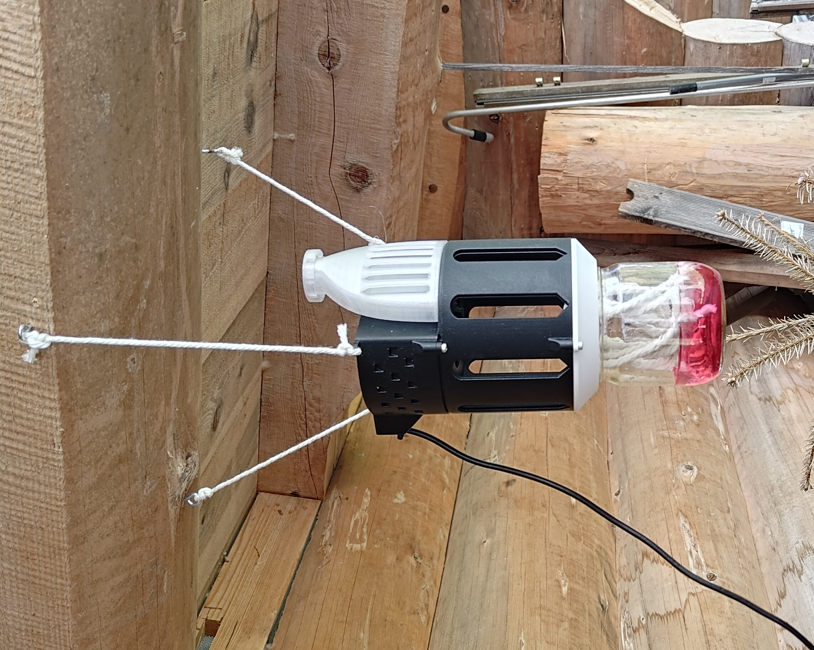
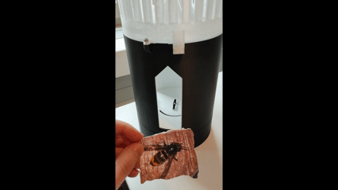

# Waspinator: Invasive Wasp Detection and Capture

A Python tool for **detecting and catching the invasive _Vespa velutina_**, while recognizing and **not triggering on native _Vespa crabro_**. Powered by the latest YOLO26 object detection model from Ultralytics.

Developed by **[Lab42](#lab42-contributors) at ERNI** ([betterask.erni](https://betterask.erni))

### V2 Trap Design
**[V2 Trap — Open interactive 3D viewer](hardware/trap_v2.2%20-%20assembled.stl)**

**V2 trap deployed in the field**



### Detection in Action (V1 Prototype)

**Tracking a _Vespa velutina_**


**Tracking a _Vespa crabro_**


**Capturing a paper _Vespa velutina_ with the V1 prototype trap**



---

## Features

- Accurate distinction between *Vespa velutina* and *Vespa crabro*
- Automated or dry-run trap triggering
- Real-time detection from camera, image, video, or CSV files

---

## Getting Started

### Installation

Clone the repository and install dependencies:
```bash
git clone https://github.com/gitDew/waspinator.git
cd waspinator

python -m venv .venv

# Activate the virtual environment
#bash
source .venv/bin/activate
#windows
.\.venv\Scripts\Activate.ps1

#then install requirements
pip install -r requirements.txt
```


### Raspberry Pi 5

If you want to run Waspinator directly on a Raspberry Pi 5 (in [your own 3D printed trap](#hardware--3d-printing-by-dariohefti)), follow these steps to set up your environment:

1. **Install required system packages:**
    ```bash
    sudo apt update
    sudo apt install -y libgl1 libglib2.0-0
    sudo apt install python3-picamera2
    ```

2. **Make changes to config**
    ```bash
    sudo nano /boot/firmware/config.txt
    
    #add the following line to the file somewhere at the top
    dtoverlay=pwm-2chan

    #restart your device
    sudo reboot
    ```

3. **Set up a Python virtual environment (recommended):**
    ```bash
    # Create virtual environment
    python -m venv .venv --system-site-packages

    # Activate the virtual environment
    source .venv/bin/activate
    ```

4. **Install Python dependencies:**
    ```bash
    pip install --upgrade pip
    pip install -r requirements.txt
    ```

5. **Run Setup to move servo to initial position**
    ```bash
    python -m waspinator setup
    ```
    Once this ran, you can screw in the motor lever to the servo and make sure that the trap is in the OPEN state.
    After that you can mount the camera and close up the entire trap. it should be ready now.

The Pi Camera module is supported via `python3-picamera2` so you can use the camera as a video source for wasp detection and trapping.  
Make sure your camera is enabled and properly connected.

Once everything is installed, you can start Waspinator as described in the [Usage](#usage) section.

### Requirements

- Python 3.8+
- [Ultralytics YOLO](https://docs.ultralytics.com/)
- Other dependencies as per `requirements.txt`

---

## Usage

Run the main detection-and-capture script via command line:

### Start Waspinator Trap

Detect and catch invasive *Vespa velutina* from picamera2 (**default**):

```bash
python -m waspinator start
```

From a video file:
```bash
python -m waspinator start --source path/to/video.mp4
```

Image file:
```bash
python -m waspinator start --source path/to/image.jpg
```

CSV file (for batch inference):
```bash
python -m waspinator start --source path/to/inputs.csv
```

#### Useful Options

- `--dry-run`: Do not trigger trap hardware (simulation mode)
    ```bash
    python -m waspinator start --dry-run
    ```
- `--show`: Display real-time frames/results
    ```bash
    python -m waspinator start --show
    ```
- `--step`: Manual stepping through frames (press SPACE to advance)

For all options:
```bash
python -m waspinator start --help
```

## Hardware & 3D Printing (by [@DarioHefti](https://github.com/DarioHefti))

Prototype 3D models for the waspinator trap are available in the [`hardware/`](hardware/) directory as `.stl` files. You can freely download and print these files to build your own trap housing.

## Lab42 Contributors
- Stefan Bräm
- Stefan Hoehne
- Francesco Farinoli
- Dietmar Hummel ([@hudi84](https://github.com/hudi84))
- Dario Hefti ([@DarioHefti](https://github.com/DarioHefti))
- Krisztián Harmat ([@gitDew](https://github.com/gitDew))

